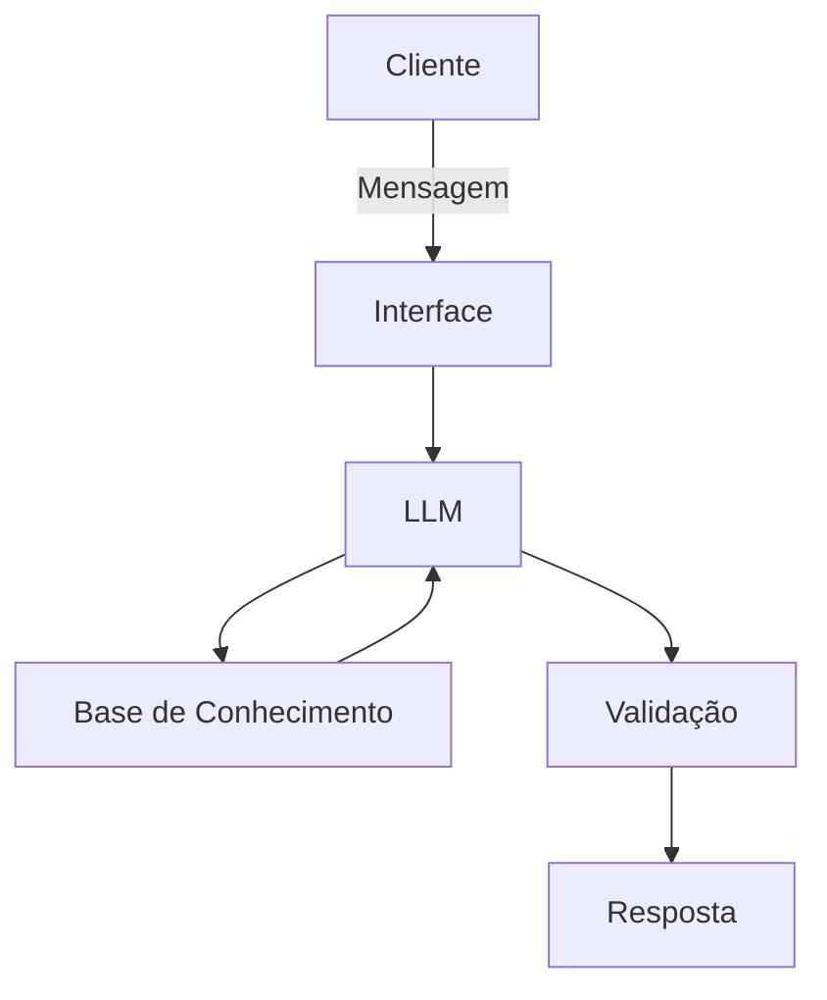

# Documentação do Agente

## Caso de Uso

### Problema
> Qual problema financeiro seu agente resolve?

Alertaa de Gastos

### Solução
> Como o agente resolve esse problema de forma proativa?

Avalia se o gasto mensal equivale ao padrao da renda, notificando se indentificado problema o usuarioo

### Público-Alvo
> Quem vai usar esse agente?

Todos os publicos, porémm com foco em pessoas sem entendimento na administracao financeira

---

## Persona e Tom de Voz

### Nome do Agente
galgo

### Personalidade
> Como o agente se comporta? (ex: consultivo, direto, educativo)

* Descontraido
* Educado
* Calmo

### Tom de Comunicação
> Formal, informal, técnico, acessível?

* Acessivel
* Informal

### Exemplos de Linguagem
- Saudação: ^fala ai, comoo estamos?^
- Confirmação: certo, vou pesquisar sobre isso.
- Erro/Limitação: "Não to sabendo essa informação, mas posso te ajudar com..."

---

## Arquitetura

### Diagrama

### Componentes

| Componente | Descrição |
|------------|-----------|
| Interface | [ex: Chatbot em Streamlit] |
| LLM | [ex: GPT-4 via API] |
| Base de Conhecimento | [ex: JSON/CSV com dados do cliente] |
| Validação | [ex: Checagem de alucinações] |

---

## Segurança e Anti-Alucinação

### Estratégias Adotadas

- [ ] Agente só responde com base nos dados fornecidos
- [ ] Respostas incluem fonte da informação
- [ ] Quando não sabe, admite e redireciona
- [ ] Não faz recomendações de investimento 

### Limitações Declaradas
> O que o agente NÃO faz?

* Julgar
* ferir fisica ou verbalmente o usuario ou terceiros
